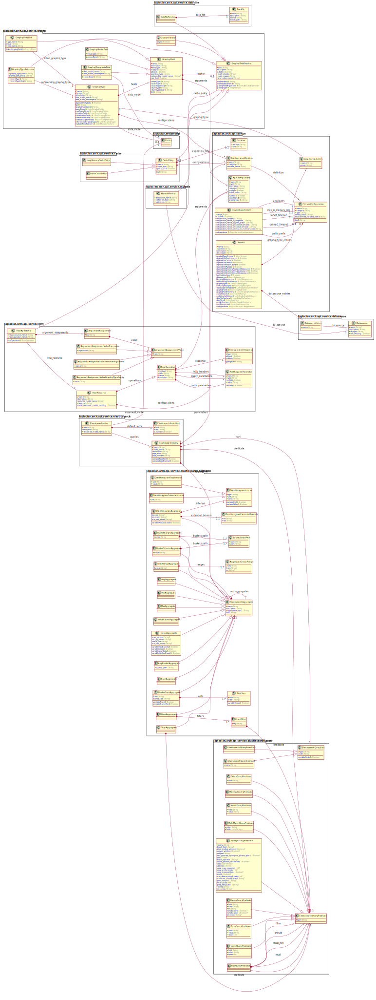

<!-- @head-content@ -->
# laplacian-arch/service-api.schema-model

A model that expresses the logical structure of a service API.
This model consists of REST api model, GraphQL interface model, and datasource usage model.

<!-- @head-content@ -->

<!-- @toc@ -->
## Table of contents
1. [Usage](#usage)

1. [Schema model](#schema-model)

1. [Source list](#source-list)


<!-- @toc@ -->

<!-- @main-content@ -->
## Usage

Add the following entry to your project definition.
```yaml
project:
  models:
  - group: laplacian-arch
    name: service-api.schema-model
    version: 1.0.0
```


## Schema model


### Model overview

The following diagram summarizes the structure of the model:



### Entities

- [**Entity**](<./doc/entities/Entity.md>)
  エンティティ
- [**NamedParam**](<./doc/entities/NamedParam.md>)
  named_param
- [**NamedValue**](<./doc/entities/NamedValue.md>)
  named_value
- [**Property**](<./doc/entities/Property.md>)
  property
- [**PropertyMapping**](<./doc/entities/PropertyMapping.md>)
  property_mapping
- [**Query**](<./doc/entities/Query.md>)
  The queries from which all navigation originates.
- [**Relationship**](<./doc/entities/Relationship.md>)
  relationship
- [**ValueDomainType**](<./doc/entities/ValueDomainType.md>)
  value_domain_type
- [**ValueDomain**](<./doc/entities/ValueDomain.md>)
  value_domain
- [**ValueItem**](<./doc/entities/ValueItem.md>)
  value_item
- [**DataAccess**](<./doc/entities/DataAccess.md>)
  A *DataAccess* represents an interface through which an client retrieve data from a *DataSource*.
- [**Datasource**](<./doc/entities/Datasource.md>)
  A *DataSource* represents a connection to a data store, such as an RDBMS.
- [**EntityReference**](<./doc/entities/EntityReference.md>)
  entity_reference
- [**GraphqlQuery**](<./doc/entities/GraphqlQuery.md>)
  graphql_query
- [**RestDataItem**](<./doc/entities/RestDataItem.md>)
  rest_data_item
- [**RestOperation**](<./doc/entities/RestOperation.md>)
  rest_operation
- [**RestResource**](<./doc/entities/RestResource.md>)
  rest_resource
- [**Service**](<./doc/entities/Service.md>)
  service
- [**ResourceEntry**](<./doc/entities/ResourceEntry.md>)
  resource_entry


## Source list


[README.md](<./README.md>)

[doc/entities/DataAccess.md](<./doc/entities/DataAccess.md>)

[doc/entities/Datasource.md](<./doc/entities/Datasource.md>)

[doc/entities/EntityReference.md](<./doc/entities/EntityReference.md>)

[doc/entities/GraphqlQuery.md](<./doc/entities/GraphqlQuery.md>)

[doc/entities/ResourceEntry.md](<./doc/entities/ResourceEntry.md>)

[doc/entities/RestDataItem.md](<./doc/entities/RestDataItem.md>)

[doc/entities/RestOperation.md](<./doc/entities/RestOperation.md>)

[doc/entities/RestResource.md](<./doc/entities/RestResource.md>)

[doc/entities/Service.md](<./doc/entities/Service.md>)

[doc/image/model-diagram.svg](<./doc/image/model-diagram.svg>)

[.editorconfig](<./.editorconfig>)

[.gitattributes](<./.gitattributes>)

[.gitignore](<./.gitignore>)

[model/project/sources.yaml](<./model/project/sources.yaml>)

[model/project.yaml](<./model/project.yaml>)

[src/entities/graphql_query.yml](<./src/entities/graphql_query.yml>)

[src/entities/rest_data_item.yml](<./src/entities/rest_data_item.yml>)

[src/entities/rest_operation.yml](<./src/entities/rest_operation.yml>)

[src/entities/rest_resource.yml](<./src/entities/rest_resource.yml>)

[src/entities/service/resource_entry.yaml](<./src/entities/service/resource_entry.yaml>)

[src/entities/service.yml](<./src/entities/service.yml>)

[src/value_domain_types/http_method_for_rest.yaml](<./src/value_domain_types/http_method_for_rest.yaml>)

[src/value_domain_types/url_path_with_placeholders.yaml](<./src/value_domain_types/url_path_with_placeholders.yaml>)


<!-- @main-content@ -->