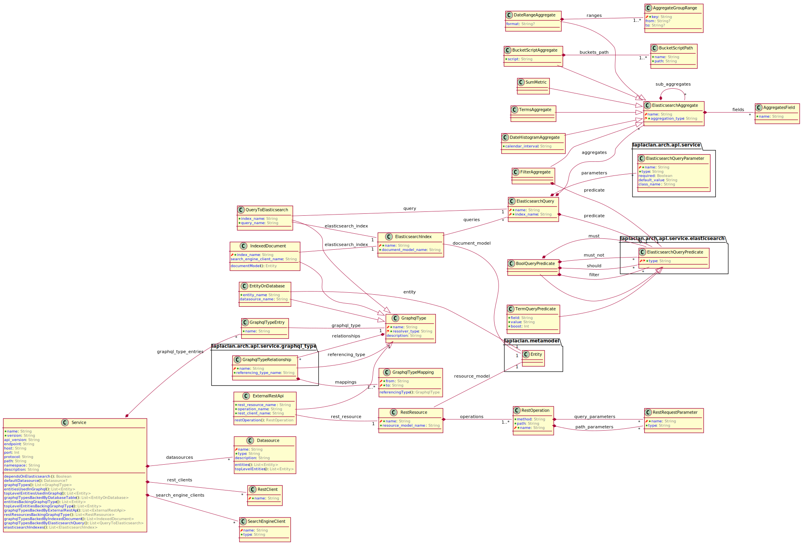

<!-- @head-content@ -->
# laplacian-arch/api-service.domain-model

APIサービスの論理構造を表すドメインモデルです。
このモデルは、RESTリソース、GraphQLインタフェース定義モデルおよび、
データソースアクセスモデルによって構成されます。


*Read this in other languages*: [[English](README.md)] [[简体中文](README_zh.md)]
<!-- @head-content@ -->

<!-- @toc@ -->
## Table of contents
- [概要](#概要)

  * [モデル概要](#モデル概要)

- [使用方法](#使用方法)

- [インデックス](#インデックス)

  * [エンティティ一覧](#エンティティ一覧)

  * [スクリプト一覧](#スクリプト一覧)

  * [ソースコード一覧](#ソースコード一覧)


<!-- @toc@ -->

<!-- @main-content@ -->
## 概要


### モデル概要


以下の図は、このモジュールに含まれる各エンティティの内容とそれらの間の関係を表しています。


## 使用方法

この modelモジュールを適用するには、プロジェクト定義に以下のエントリを追加してください。
```yaml
project:
  models:
  - group: laplacian-arch
    name: api-service.domain-model
    version: 1.0.0
```

下記のコマンドを実行すると、このモジュールの適用によって影響を受ける資源の一覧とその内容を確認できます。

```console
$ ./script/generate --dry-run

diff --color -r PROJECT_HOME/.NEXT/somewhere/something.md PROJECT_HOME/somewhere/something.md
1,26c1,10
< content: OLD CONTENT
---
> content: NEW CONTENT
```

内容に問題が無ければ、下記コマンドを実行して変更を反映してください。

```console
$ ./script/generate

```


## インデックス


### エンティティ一覧


- [**ApiCallArgument**](<./doc/entities/ApiCallArgument.md>)
api_call_argument
- [**CachePolicy**](<./doc/entities/CachePolicy.md>)
cache_policy
- [**HeapMemoryCachePolicy**](<./doc/entities/HeapMemoryCachePolicy.md>)
heap_memory_cache_policy
- [**RedisCachePolicy**](<./doc/entities/RedisCachePolicy.md>)
redis_cache_policy
- [**Duration**](<./doc/entities/Duration.md>)
duration
- [**AvgBucketAggregate**](<./doc/entities/AvgBucketAggregate.md>)
avg_bucket_aggregate
- [**BucketScriptAggregate**](<./doc/entities/BucketScriptAggregate.md>)
bucket_script_aggregate
- [**BucketScriptPath**](<./doc/entities/BucketScriptPath.md>)
bucket_script_path
- [**BucketSelectorAggregate**](<./doc/entities/BucketSelectorAggregate.md>)
bucket_selector_aggregate
- [**BucketSortAggregate**](<./doc/entities/BucketSortAggregate.md>)
bucket_sort_aggregate
- [**FieldSort**](<./doc/entities/FieldSort.md>)
field_sort
- [**DateHistogramAggregate**](<./doc/entities/DateHistogramAggregate.md>)
date_histogram_aggregate
- [**DateHistogramExtendedBounds**](<./doc/entities/DateHistogramExtendedBounds.md>)
date_histogram_extended_bounds
- [**DateHistogramInterval**](<./doc/entities/DateHistogramInterval.md>)
date_histogram_interval
- [**DateHistogramCalendarInterval**](<./doc/entities/DateHistogramCalendarInterval.md>)
date_histogram_calendar_interval
- [**DateHistogramFixedInterval**](<./doc/entities/DateHistogramFixedInterval.md>)
date_histogram_fixed_interval
- [**DateRangeAggregate**](<./doc/entities/DateRangeAggregate.md>)
date_range_aggregate
- [**AggregateGroupRange**](<./doc/entities/AggregateGroupRange.md>)
aggregate_group_range
- [**FilterAggregate**](<./doc/entities/FilterAggregate.md>)
filter_aggregate
- [**FiltersAggregate**](<./doc/entities/FiltersAggregate.md>)
filters_aggregate
- [**KeyedFilter**](<./doc/entities/KeyedFilter.md>)
keyed_filter
- [**SumAggregate**](<./doc/entities/SumAggregate.md>)
sum_aggregate
- [**AvgAggregate**](<./doc/entities/AvgAggregate.md>)
avg_aggregate
- [**MinAggregate**](<./doc/entities/MinAggregate.md>)
min_aggregate
- [**MaxAggregate**](<./doc/entities/MaxAggregate.md>)
max_aggregate
- [**ValueCountAggregate**](<./doc/entities/ValueCountAggregate.md>)
value_count_aggregate
- [**TermsAggregate**](<./doc/entities/TermsAggregate.md>)
A multi-bucket value source based aggregation where buckets are dynamically built
- one per unique value.
- [**ElasticsearchAggregate**](<./doc/entities/ElasticsearchAggregate.md>)
elasticsearch_aggregate
- [**ElasticsearchIndex**](<./doc/entities/ElasticsearchIndex.md>)
elasticsearch_index
- [**ElasticsearchIndexSort**](<./doc/entities/ElasticsearchIndexSort.md>)
elasticsearch_index_sort
- [**ElasticsearchQueryPredicate**](<./doc/entities/ElasticsearchQueryPredicate.md>)
elasticsearch_query_predicate
- [**ElasticsearchQuerySort**](<./doc/entities/ElasticsearchQuerySort.md>)
elasticsearch_query_sort
- [**ElasticsearchQueryScoreSort**](<./doc/entities/ElasticsearchQueryScoreSort.md>)
elasticsearch_query_score_sort
- [**ElasticsearchQueryFieldSort**](<./doc/entities/ElasticsearchQueryFieldSort.md>)
elasticsearch_query_field_sort
- [**ElasticsearchQuery**](<./doc/entities/ElasticsearchQuery.md>)
elasticsearch_query
- [**BoolQueryPredicate**](<./doc/entities/BoolQueryPredicate.md>)
bool_query_predicate
- [**ExistsQueryPredicate**](<./doc/entities/ExistsQueryPredicate.md>)
exists_query_predicate
- [**MatchAllQueryPredicate**](<./doc/entities/MatchAllQueryPredicate.md>)
match_all_query_predicate
- [**MatchQueryPredicate**](<./doc/entities/MatchQueryPredicate.md>)
match_query_predicate
- [**MultiMatchQueryPredicate**](<./doc/entities/MultiMatchQueryPredicate.md>)
multi_match_query_predicate
- [**QueryStringPredicate**](<./doc/entities/QueryStringPredicate.md>)
query_string_predicate
- [**RangeQueryPredicate**](<./doc/entities/RangeQueryPredicate.md>)
range_query_predicate
- [**TermQueryPredicate**](<./doc/entities/TermQueryPredicate.md>)
term_query_predicate
- [**TermsQueryPredicate**](<./doc/entities/TermsQueryPredicate.md>)
terms_query_predicate
- [**EntityOnDatabase**](<./doc/entities/EntityOnDatabase.md>)
entity_on_database
- [**ExternalRestResource**](<./doc/entities/ExternalRestResource.md>)
external_rest_resource
- [**IndexedDocument**](<./doc/entities/IndexedDocument.md>)
indexed_document
- [**RestOperation**](<./doc/entities/RestOperation.md>)
rest_operation
- [**RestRequestParameter**](<./doc/entities/RestRequestParameter.md>)
rest_request_parameter
- [**RestResource**](<./doc/entities/RestResource.md>)
rest_resource
- [**Service**](<./doc/entities/Service.md>)
service
- [**Datasource**](<./doc/entities/Datasource.md>)
A *DataSource* represents an interface through which a client application access to a data store.
This includes the following models.
- The entity that the datastore exposes to the client
- Statement issued by the client to the datastore
- [**ElasticSearchClient**](<./doc/entities/ElasticSearchClient.md>)
elastic_search_client
- [**GraphqlType**](<./doc/entities/GraphqlType.md>)
graphql_type
- [**GraphqlTypeEntry**](<./doc/entities/GraphqlTypeEntry.md>)
graphql_type_entry
- [**GraphqlTypeRelationship**](<./doc/entities/GraphqlTypeRelationship.md>)
graphql_type_relationship
- [**GraphqlIndexedDocumentRelationship**](<./doc/entities/GraphqlIndexedDocumentRelationship.md>)
graphql_indexed_document_relationship
- [**GraphqlTypeRelationshipFieldMapping**](<./doc/entities/GraphqlTypeRelationshipFieldMapping.md>)
graphql_type_relationship_field_mapping
- [**RestClient**](<./doc/entities/RestClient.md>)
rest_client
- [**ServiceConfiguration**](<./doc/entities/ServiceConfiguration.md>)
service_configuration
- [**ServiceConfigurationCategory**](<./doc/entities/ServiceConfigurationCategory.md>)
service_configuration_category
- [**ConfigurationBinding**](<./doc/entities/ConfigurationBinding.md>)
configuration_binding
### スクリプト一覧


- [./script/generate.sh](<./scripts/generate.sh>)

  このプロジェクト内の資源を自動生成します。
  `src/` `model/` `template/` の各ディレクトリに格納された資源をもとに自動生成を行い、その結果を`dest/` `doc/` `script/` の各ディレクトリに反映します。

  *自動生成入力ファイル*

  - `src/`
    自動生成の対象とならない静的な資源を格納します。
    このディレクトリの内容は `dest/` 配下にそのままコピーされます。

  - `model/`
    自動生成で使用されるYAMLもしくはJSON形式で記述された静的なモデルデータを格納します。

  - `template/`
    自動生成で使用されるテンプレートファイルを格納します。ファイル拡張子に `.hbs` を含むファイルがテンプレートして扱われます。
    それ以外のファイルはそのままコピーされます。

    - `template/dest` `template/doc` `template/scripts`
      これらのディレクトリはそれぞれ、`dest/` `doc/` `scripts`の各ディレクトリに出力される資源のテンプレートを格納します。

    - `template/model` `template/template`
      自動生成で使用される`template/` `model/`の内容を更新するためのテンプレートを格納します。
      自動生成の結果、`template/` `model/` の内容が更新された場合は、自動生成処理を再帰的に実行します。
      なお、上記処理中に発生した`template/` `model/`への変更は、中間状態として扱われるため、処理完了後は失われます。
      これらの中間ファイルを確認するためには *--dry-run* オプションを使用してください。

  *自動生成結果ファイル*

  - `dest/`
    自動生成の結果作成されるアプリケーションやモジュールのソースファイル等を出力します。

  - `doc/`
    プロジェクトのドキュメントを出力します。

  - `scripts/`
    開発・運用で使用する各種スクリプトを出力します。

  > Usage: generate.sh [OPTION]...
  >
  > -h, --help
  >
  >   このコマンドの使用方法を表示します。
  >   
  > -v, --verbose
  >
  >   より詳細なコマンドの実行情報を表示します。
  >   
  > -d, --dry-run
  >
  >   自動生成処理を実行後、生成されたファイルを`dest/` `doc/` `scripts/`の各フォルダに反映せずに、`.NEXT`ディレクトリに出力します。
  >   また、`.NEXT`ディレクトリの内容と現在のファイルの差異を出力します。
  >   このディレクトリには自動生成中に作成された中間ファイルも含まれます。
  >   
  > -r, --max-recursion [VALUE]
  >
  >   自動生成処理中に`model/` `template/`ディレクトリの内容が更新された場合に、
  >   再帰的に自動生成処理を実行する回数の上限。
  >    (Default: 10)
  > , --local-module-repository [VALUE]
  >
  >   ローカルでビルドされたモジュールを格納するリポジトリのパス。
  >   ここに存在するモジュールが最優先で参照されます。
  >   
  > , --updates-scripts-only
  >
  >   スクリプトファイルのみを更新の対象とします。
  >   プロジェクトを初期生成する際、自動生成スクリプト自体を初回作成する場合などに指定します。
  >   
- [./script/publish-local.sh](<./scripts/publish-local.sh>)

  プロジェクト内の資源を自動生成した後、ディレクトリにある資源をモデルモジュールとしてビルドし、
  ローカルリポジトリに登録します。

  > Usage: publish-local.sh [OPTION]...
  >
  > -h, --help
  >
  >   このコマンドの使用方法を表示します。
  >   
  > -v, --verbose
  >
  >   より詳細なコマンドの実行情報を表示します。
  >   
  > -r, --max-recursion [VALUE]
  >
  >   [generate.sh](<./scripts/generate.sh>)の同名のオプションと同じものです。
  >    (Default: 10)
  > , --skip-generation
  >
  >   自動生成処理を行わずに、ビルドおよびローカルリポジトリへの登録を行います。
  >   
  > , --local-module-repository [VALUE]
  >
  >   ビルドしたモジュールを格納するローカルリポジトリのパス。
  >   指定したパスにリポジトリが存在しない場合は、自動的に作成されます。
  >   
### ソースコード一覧


- [model/project.yaml](<./model/project.yaml>)
- [src/model/entities/api-call-argument.yaml](<./src/model/entities/api-call-argument.yaml>)
- [src/model/entities/cache-policy/cache-policy.yaml](<./src/model/entities/cache-policy/cache-policy.yaml>)
- [src/model/entities/cache-policy/heap-memory-cache-configuration.yaml](<./src/model/entities/cache-policy/heap-memory-cache-configuration.yaml>)
- [src/model/entities/cache-policy/redis-cache-configuration.yaml](<./src/model/entities/cache-policy/redis-cache-configuration.yaml>)
- [src/model/entities/duration.yaml](<./src/model/entities/duration.yaml>)
- [src/model/entities/elasticsearch/aggregate/avg-bucket-aggregate.yaml](<./src/model/entities/elasticsearch/aggregate/avg-bucket-aggregate.yaml>)
- [src/model/entities/elasticsearch/aggregate/bucket-script-aggregate.yaml](<./src/model/entities/elasticsearch/aggregate/bucket-script-aggregate.yaml>)
- [src/model/entities/elasticsearch/aggregate/bucket-selector-aggregate.yaml](<./src/model/entities/elasticsearch/aggregate/bucket-selector-aggregate.yaml>)
- [src/model/entities/elasticsearch/aggregate/bucket-sort-aggregate.yaml](<./src/model/entities/elasticsearch/aggregate/bucket-sort-aggregate.yaml>)
- [src/model/entities/elasticsearch/aggregate/date-histogram-aggregate.yaml](<./src/model/entities/elasticsearch/aggregate/date-histogram-aggregate.yaml>)
- [src/model/entities/elasticsearch/aggregate/date-range-aggregate.yaml](<./src/model/entities/elasticsearch/aggregate/date-range-aggregate.yaml>)
- [src/model/entities/elasticsearch/aggregate/filter-aggregate.yaml](<./src/model/entities/elasticsearch/aggregate/filter-aggregate.yaml>)
- [src/model/entities/elasticsearch/aggregate/filters-aggregate.yaml](<./src/model/entities/elasticsearch/aggregate/filters-aggregate.yaml>)
- [src/model/entities/elasticsearch/aggregate/metrics-aggregations.yaml](<./src/model/entities/elasticsearch/aggregate/metrics-aggregations.yaml>)
- [src/model/entities/elasticsearch/aggregate/terms-aggregate.yaml](<./src/model/entities/elasticsearch/aggregate/terms-aggregate.yaml>)
- [src/model/entities/elasticsearch/elasticsearch-aggregate.yaml](<./src/model/entities/elasticsearch/elasticsearch-aggregate.yaml>)
- [src/model/entities/elasticsearch/elasticsearch-index.yaml](<./src/model/entities/elasticsearch/elasticsearch-index.yaml>)
- [src/model/entities/elasticsearch/elasticsearch-query-predicate.yaml](<./src/model/entities/elasticsearch/elasticsearch-query-predicate.yaml>)
- [src/model/entities/elasticsearch/elasticsearch-query-sort.yaml](<./src/model/entities/elasticsearch/elasticsearch-query-sort.yaml>)
- [src/model/entities/elasticsearch/elasticsearch-query.yaml](<./src/model/entities/elasticsearch/elasticsearch-query.yaml>)
- [src/model/entities/elasticsearch/predicate/bool-query-predicate.yaml](<./src/model/entities/elasticsearch/predicate/bool-query-predicate.yaml>)
- [src/model/entities/elasticsearch/predicate/exists-query-predicate.yaml](<./src/model/entities/elasticsearch/predicate/exists-query-predicate.yaml>)
- [src/model/entities/elasticsearch/predicate/match-all-query-predicate.yaml](<./src/model/entities/elasticsearch/predicate/match-all-query-predicate.yaml>)
- [src/model/entities/elasticsearch/predicate/match-query-predicate.yaml](<./src/model/entities/elasticsearch/predicate/match-query-predicate.yaml>)
- [src/model/entities/elasticsearch/predicate/multi-match-query-predicate.yaml](<./src/model/entities/elasticsearch/predicate/multi-match-query-predicate.yaml>)
- [src/model/entities/elasticsearch/predicate/query-string-query-predicate.yaml](<./src/model/entities/elasticsearch/predicate/query-string-query-predicate.yaml>)
- [src/model/entities/elasticsearch/predicate/range-query-predicate.yaml](<./src/model/entities/elasticsearch/predicate/range-query-predicate.yaml>)
- [src/model/entities/elasticsearch/predicate/term-query-predicate.yaml](<./src/model/entities/elasticsearch/predicate/term-query-predicate.yaml>)
- [src/model/entities/elasticsearch/predicate/terms-query-predicate.yaml](<./src/model/entities/elasticsearch/predicate/terms-query-predicate.yaml>)
- [src/model/entities/graphql_type/entity_on_database.yaml](<./src/model/entities/graphql_type/entity_on_database.yaml>)
- [src/model/entities/graphql_type/external_rest_resource.yaml](<./src/model/entities/graphql_type/external_rest_resource.yaml>)
- [src/model/entities/graphql_type/indexed_document.yaml](<./src/model/entities/graphql_type/indexed_document.yaml>)
- [src/model/entities/rest_resource/rest_operation.yaml](<./src/model/entities/rest_resource/rest_operation.yaml>)
- [src/model/entities/rest_resource/rest_request_parameter.yaml](<./src/model/entities/rest_resource/rest_request_parameter.yaml>)
- [src/model/entities/rest_resource/rest_resource.yaml](<./src/model/entities/rest_resource/rest_resource.yaml>)
- [src/model/entities/service/datasource.yaml](<./src/model/entities/service/datasource.yaml>)
- [src/model/entities/service/elastic-search-client.yaml](<./src/model/entities/service/elastic-search-client.yaml>)
- [src/model/entities/service/graphql_type_entry.yaml](<./src/model/entities/service/graphql_type_entry.yaml>)
- [src/model/entities/service/graphql_type_relationship.yaml](<./src/model/entities/service/graphql_type_relationship.yaml>)
- [src/model/entities/service/graphql_type.yaml](<./src/model/entities/service/graphql_type.yaml>)
- [src/model/entities/service/rest_client.yaml](<./src/model/entities/service/rest_client.yaml>)
- [src/model/entities/service/service_configuration.yaml](<./src/model/entities/service/service_configuration.yaml>)
- [src/model/entities/service.yml](<./src/model/entities/service.yml>)
- [src/model/value_domain_types/http_method_for_rest.yaml](<./src/model/value_domain_types/http_method_for_rest.yaml>)
- [src/model/value_domain_types/integer_or_placeholder.yaml](<./src/model/value_domain_types/integer_or_placeholder.yaml>)
- [src/model/value_domain_types/service_configuration_name.yaml](<./src/model/value_domain_types/service_configuration_name.yaml>)
- [src/model/value_domain_types/sort_order_or_placeholder.yaml](<./src/model/value_domain_types/sort_order_or_placeholder.yaml>)
- [src/model/value_domain_types/url_path_with_placeholders.yaml](<./src/model/value_domain_types/url_path_with_placeholders.yaml>)


<!-- @main-content@ -->